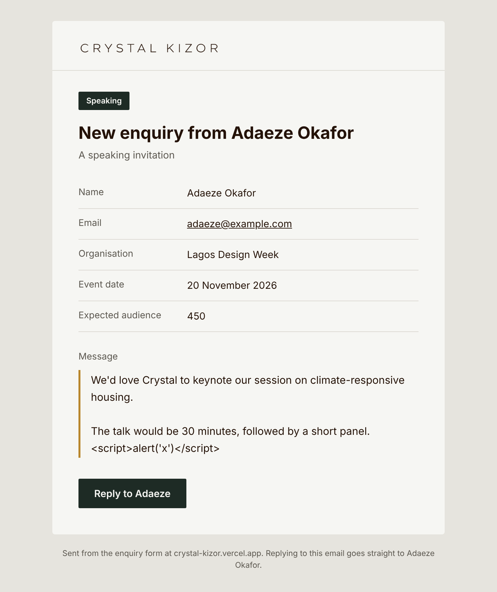

# Crystal Kizor: Landing Page

A single-page site that brings Crystal Kizor's seven brands together under one personal brand. Built for Studio COKA's Web Developer assessment (Stage 1).

**Live site:** [crystal-kizor-landing.vercel.app](https://crystal-kizor-landing.vercel.app)

> This is a candidate assessment, not an official Crystal Kizor website. It is excluded from search engines (`noindex`).


---

## The thinking

Crystal's work spans architecture, furniture, education, speaking, writing and two mission-driven initiatives. Listing seven brands side by side would read as unrelated businesses, so the page works as a **router**: every brand sits under one of four visitor intents.

| Path              | For                               | Brands                                      |
| ----------------- | --------------------------------- | ------------------------------------------- |
| Build with her    | Clients and specifiers            | Studio COKA, ELEvated                       |
| Learn from her    | Architects and students           | The Effective Architect, Research & Writing |
| Book her to speak | Event organisers and media        | Speaking engagements                        |
| Join the mission  | Partners, donors and young people | AKO Alliance, Alive and Free                |

The page leads with proof (Nigeria's first off-grid hospital and its measured results) and every path ends in one enquiry form that adapts to the visitor's intent.

Full reasoning and trade-offs: **[docs/decisions.md](docs/decisions.md)**.

## Sections

1. **Hero:** her wordmark, positioning, portrait and a breeze-block screen with drifting sunlight
2. **Where would you like to start?** The four paths
3. **Built for this climate:** the off-grid hospital, three featured projects, ELEvated
4. **Teaching what she builds:** The Effective Architect, writing, speaking
5. **Building people, not only places:** AKO Alliance, Alive and Free
6. **About**
7. **Start a conversation:** the enquiry form

## Stack

- **Next.js 16** (App Router, Server Components, Server Actions), **React 19**, **TypeScript** (strict, with `noUncheckedIndexedAccess`)
- **Tailwind CSS v4** with design tokens in `@theme`
- **Zod** for form and environment validation
- **Resend** for email delivery
- `next/font` (Archivo, self-hosted) and `next/image` (AVIF and WebP)

## Architecture

```
src/
├── app/           Routes only: layout, page, robots, sitemap
├── components/
│   ├── layout/    Header, Footer
│   ├── sections/  One component per page section
│   ├── forms/     EnquiryForm (the only client component)
│   ├── seo/       JSON-LD
│   └── ui/        Reusable primitives: Picture, ButtonLink, TextLink, Field, SectionHeader…
├── config/        Site behaviour (URL, indexing, locale)
├── constants/     Runtime vocabulary that types derive from
├── content/       Every word and image reference on the page, behind async getters
├── lib/           Singletons and clients: env, Resend, SEO builders
├── schemas/       Zod schemas
├── server/
│   ├── actions/   Server Actions: validate input, shape UI state
│   ├── services/  Business logic: send the enquiry
│   └── templates/ Email model, HTML and plain-text renderers
├── types/         All TypeScript types; none are defined inline
└── utils/         Shared, pure helpers
```

**Read path:** `page.tsx` → section components → `content/` getters.
**Write path:** form → Server Action (Zod) → service → email template → Resend.

Standards are documented at the top of [docs/decisions.md](docs/decisions.md): no inline types, shared helpers extracted as soon as a second component needs them, content kept out of components.

## Running locally

Requires Node 20+ and pnpm.

```bash
pnpm install
cp .env.example .env.local   # then fill in the values below
pnpm dev
```

| Variable               | Purpose                                                      |
| ---------------------- | ------------------------------------------------------------ |
| `NEXT_PUBLIC_SITE_URL` | Absolute site URL, used for metadata and email links         |
| `SITE_INDEXABLE`       | `false` adds `noindex`; set `true` only for the real site    |
| `RESEND_API_KEY`       | Resend API key (starts with `re_`)                           |
| `ENQUIRY_TO`           | Inbox that receives enquiries                                |
| `ENQUIRY_FROM`         | Sender, e.g. `Crystal Kizor website <onboarding@resend.dev>` |

Environment variables are validated when the server starts: an invalid value stops `pnpm dev` and fails the build with a message naming the variable.

| Script                      | Does                        |
| --------------------------- | --------------------------- |
| `pnpm dev`                  | Development server          |
| `pnpm build` / `pnpm start` | Production build and server |
| `pnpm typecheck`            | TypeScript check            |
| `pnpm lint` / `pnpm format` | ESLint and Prettier         |

## The enquiry email

Each enquiry produces a branded HTML email with a plain-text fallback, tagged by intent so one inbox can be filtered. Replying goes straight to the visitor.



> **For reviewers:** Resend's free tier only delivers to the account owner until a domain is verified, so enquiries sent from the live demo arrive in the candidate's inbox. In production they would go to Studio COKA's inbox, and visitors would also receive an acknowledgement.

## Quality

- Lighthouse (mobile and desktop): Performance 100, Accessibility 100, Best Practices 100. SEO scores 69 only because of the deliberate `noindex`; it returns to normal when `SITE_INDEXABLE=true`.
- Keyboard navigable, with visible focus and a skip link; colour contrast checked against WCAG AA
- Animation respects `prefers-reduced-motion`
- The enquiry form works with JavaScript disabled

## Documentation

| File                                                 | Contents                                           |
| ---------------------------------------------------- | -------------------------------------------------- |
| [docs/decisions.md](docs/decisions.md)               | Engineering standards, decisions and deferred work |
| [docs/research.md](docs/research.md)                 | Public research; source for every fact on the page |
| [docs/assets.md](docs/assets.md)                     | Asset inventory and processing                     |
| [docs/part-2-ai-tool.md](docs/part-2-ai-tool.md)     | Part 2: AI product proposal                        |
| [docs/part-3-analytics.md](docs/part-3-analytics.md) | Part 3: analytics and improvement                  |

## Licence

Code © 2026 Moses Nwigberi, shared for assessment only. Brand assets belong to Crystal Kizor and Studio COKA. See [LICENSE](LICENSE).
